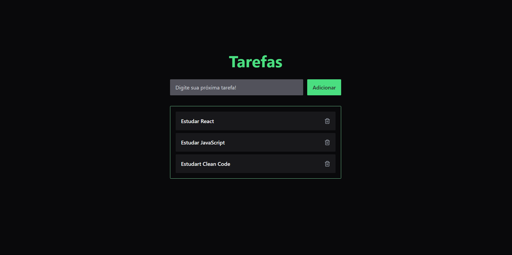
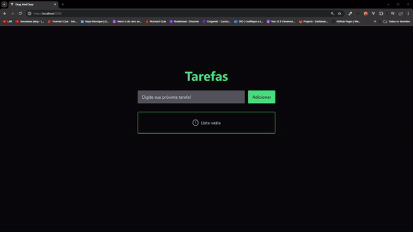

Status: Completo 🚀

## Drag And Drop
Aplicativo feito para testar a funcionalidade Drag And Drop, muito comum para redefinições de posicionamentos de elementos em listas.

## Funcionalidades:
 * Adicionar item em uma lista
 * Remover item
 * Redefinir o posicionamento de um item na lista (Drag And Drop)

<hr/>
<br/>

<center>
 <div></div>
<br/>
</center>
<br/>
<hr/>

## Tecnologias Utilizadas:

 * React
 * TailwindCSS
 * Lucide React
 * prettier plugin tailwindcss
 * typescript
 * eslint
 * hello-pangea/dnd

<br/>
<hr/>

 ## Demonstração:
 
<div>
    
</div>

## Instalação
  * Faça um clone do repositório do projeto no GitHub.
  * Navegue até o diretório do projeto.
  * Execute o seguinte comando para instalar as dependências:

```
$ pnpm install
```

## Running the project
```
$ pnpm run dev
```


